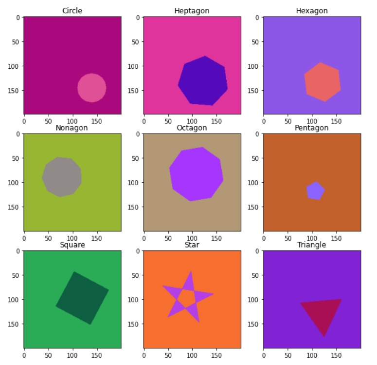

# **Shapes Classifier**
**Exploring the classification of 9 geometric shapes with a Convolution Neural Network (CNN))**

---

The data for this project comes from Mendeley Data as an 87 MB ZIP file under the name "2D geometric shapes dataset".

Citation: Anas, EL KORCHI (2020), “2D geometric shapes dataset ”, Mendeley Data, v1
http://dx.doi.org/10.17632/wzr2yv7r53.1

---

The dataset consists of **90,000** computer generated **9 different 2D geometric shapes** with randomly assigned position, size, rotation angle, background color and fill color. The shapes each exist in a **200x200 RGB image**.

There is a uniform distribution of each shape class in the dataset. The shapes included are: **Circles**, **Triangles**, **Squares**, **Pentagons**, **Hexagons**, **Heptagons**, **Octagons** and **Nonagons**. A sample of each class is shown below:

---

The main purpose of this project is to explore the use of Convolutional Neural Networks (CNN) is the classification of these 9 shapes. Since this dataset is computer-generated, enough data is available to train the CNN for this application. More data can be generated if the need arises.

The notebook - Shapes Dataset.ipynb - will explore the handling and preprocessing of images, model building and evaluation, as well as a look into the feature maps captured by the CNN. Most of this done via Python's Keras library.

The trained model is saved and available as "shapes_classifier_nn". To use the trained model for transfer learning or other purposes, the steps below can be taken:
1. Download the shapes_classifier_nn or clone the GitHub repository.
2. Install and/or import the Keras library.
3. Load the model with the command: 
    `model = keras.models.load_model(PATH_TO_SAVED_MODEL)`
4. You may view the model architecture using the command: `model.summary()`
5. The model's predict and evaluate methods can be used as normal.

*Note: The model's parameters are set to be non-trainable. Model layers can be removed with the command: model.pop()*